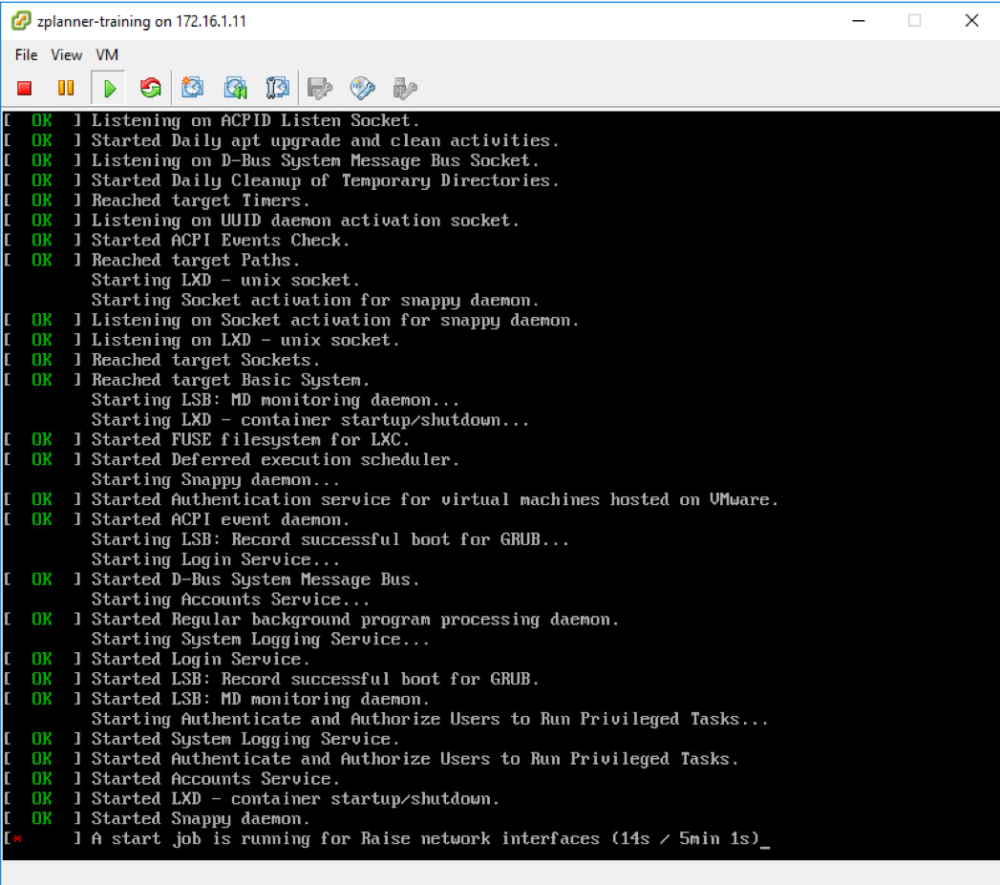
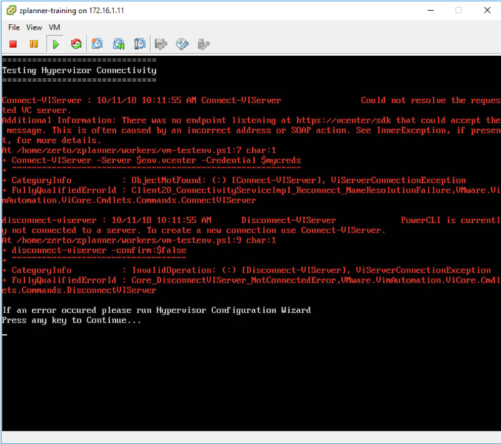
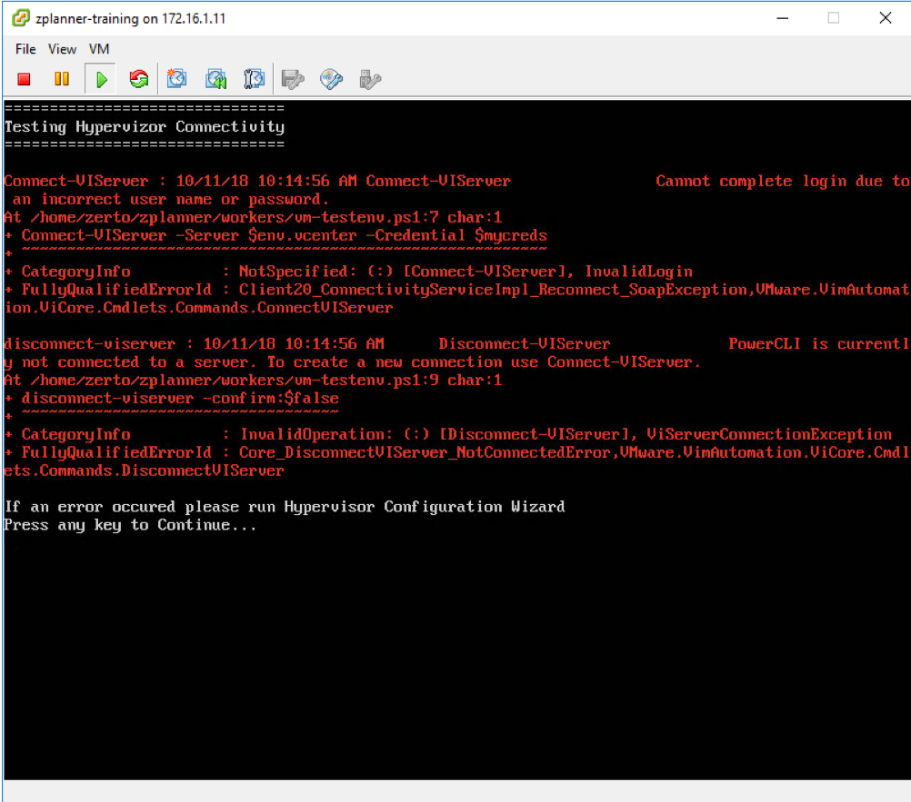
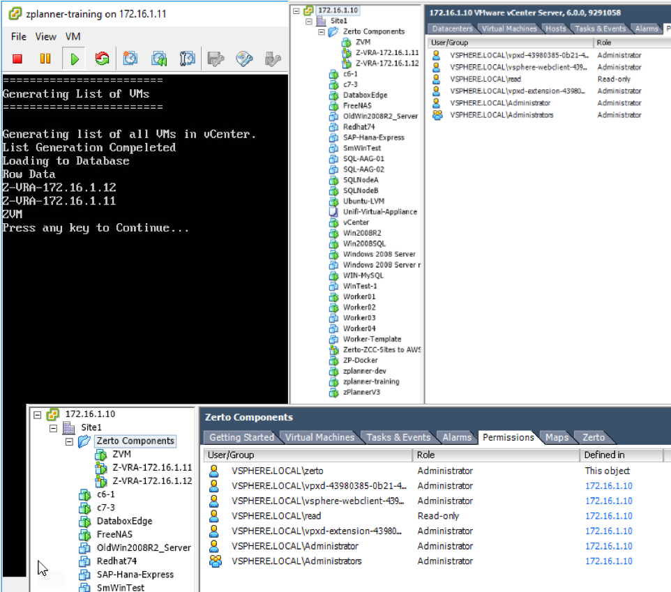

# Troubleshooting zPlanner Install Issues

## Common Installation issues

### Long boot time on first boot

If you are experiencing a long boot time after deploying the OVA, chances are that DHCP is not present on the virtual network where you attached the appliance. It will take approximately 5 minutes for Ubuntu to "give up" on DHCP and move on.
Once the appliance has booted up and you are at the console menu, select option 2 to configure a static IP address. Once you have configured a static IP address the appliance will boot up much quicker.

### Unable to connect to vCenter

If you are experiencing a

### Invalid vCenter Credentials

If you are experiencing a

### Only a partial VM list is available in Web UI

If you are experiencing a